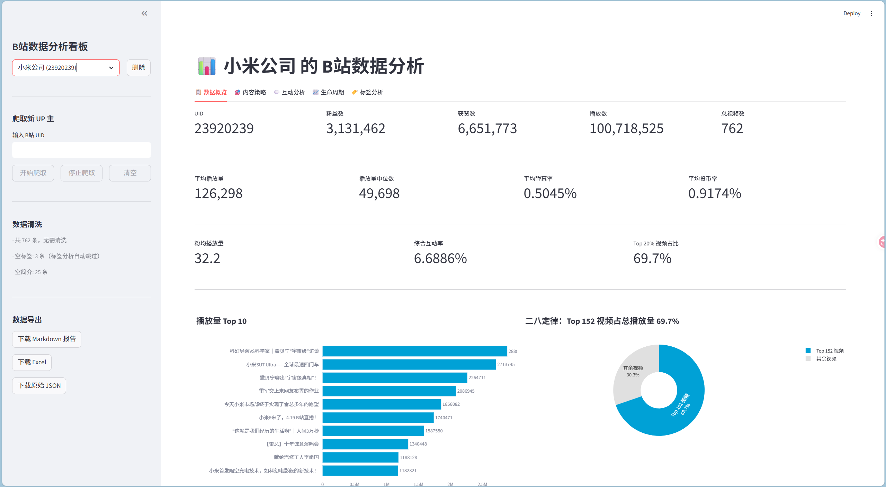
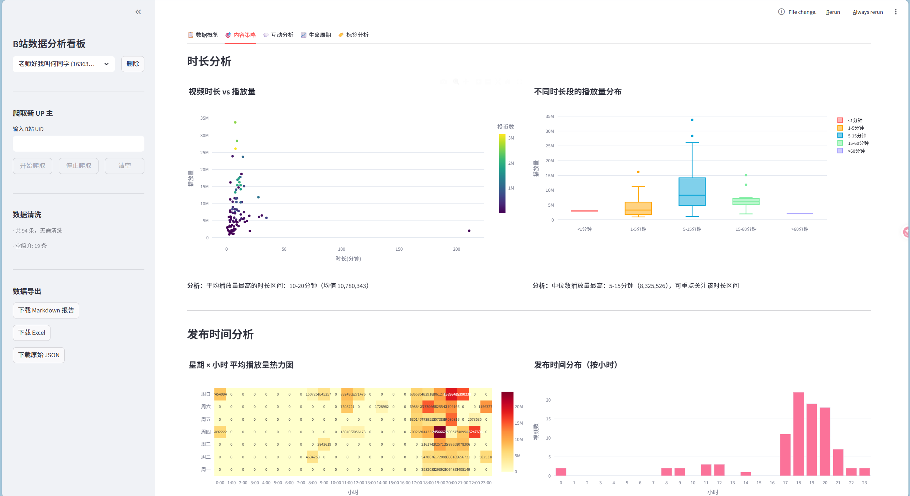
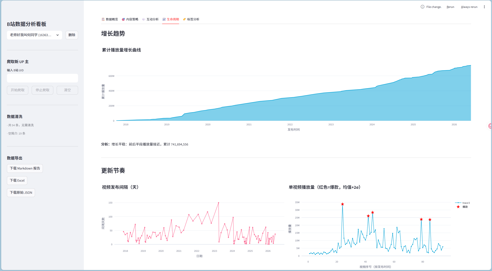
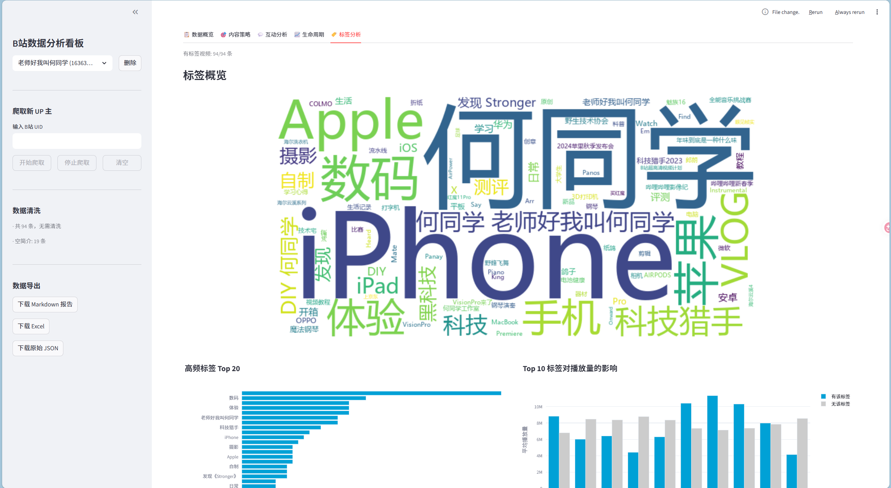
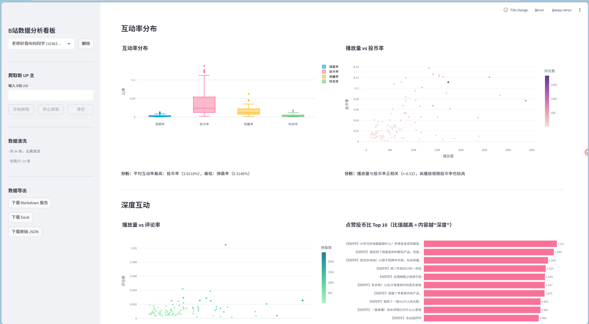

# BiliUP-Analyzer

> B站 UP 主视频数据爬虫 + 交互式分析看板

[](https://www.python.org/)
[](https://streamlit.io/)
[](LICENSE)

一个轻量级的 B站数据分析工具：自动爬取 UP 主全部视频数据，通过 5 个维度的交互式图表进行深度分析，帮助创作者了解内容表现、优化发布策略。

---

## 功能亮点

**数据采集**
- Selenium 扫码登录，后续请求全部走 `requests` + B站 API，速度快、资源占用低
- 一键爬取 UP 主全部视频：标题、简介、时长、标签、播放量、弹幕、点赞、投币、收藏、转发、评论、发布时间
- 支持从看板内直接启动爬取，实时日志、中途停止

**分析看板**
| Tab | 分析维度 | 核心图表 |
|-----|---------|---------|
| 数据概览 | 账号整体画像 | 播放量 Top10、二八定律 |
| 内容策略 | 什么内容更受欢迎 | 时长-播放量散点、发布时段热力图 |
| 互动分析 | 观众互动行为 | 互动率箱线图、播放量 vs 投币/评论率 |
| 生命周期 | 增长趋势与节奏 | 累计增长曲线、发布间隔、爆款识别 |
| 标签分析 | 标签策略优化 | 标签词云、共现网络、标签影响力对比 |

**数据导出**
- Markdown 报告（精简摘要）
- Excel 原始数据（格式化表格）
- 原始 JSON（完整数据）

---

## 快速开始

### 1. 安装依赖

```bash
pip install -r requirements.txt
```

> 需要 **Edge 浏览器**（脚本默认调用 Edge WebDriver）

### 2. 爬取数据

```bash
python run_crawler.py --uid <UP主UID>
```

首次运行会自动打开浏览器，扫码登录后 cookies 自动保存，后续无需重复登录。

### 3. 启动看板

```bash
python run_dashboard.py
```

浏览器自动打开看板，选择已有 UP 主查看分析，或输入新 UID 直接爬取。

---

## 项目结构

```
BiliUP-Analyzer/
├── crawler/
│   └── bilibili_selenium.py     # 爬虫：Selenium 登录 + API 数据采集
├── dashboard/
│   ├── app.py                   # Streamlit 主页面
│   ├── data.py                  # 数据加载、清洗、导出
│   ├── analysis.py              # 20 个分析文本函数
│   └── charts.py                # 21 个 Plotly 图表函数
├── data/
│   ├── cookies.json             # 登录凭证（已 gitignore）
│   └── raw/UID_{uid}/           # 爬取数据（已 gitignore）
├── run_crawler.py               # 爬虫入口
├── run_dashboard.py             # 看板入口
└── requirements.txt
```

---

## 技术栈

| 层 | 技术 |
|---|------|
| 数据采集 | Selenium + requests + B站 REST API（WBI 签名） |
| 数据处理 | pandas + numpy |
| 可视化 | Plotly + wordcloud + matplotlib |
| 前端看板 | Streamlit |
| 导出 | xlsxwriter（Excel）+ Markdown |

---

## 截图

### 数据概览



### 内容策略



### 互动分析



### 生命周期



### 标签分析



---

## License

MIT
